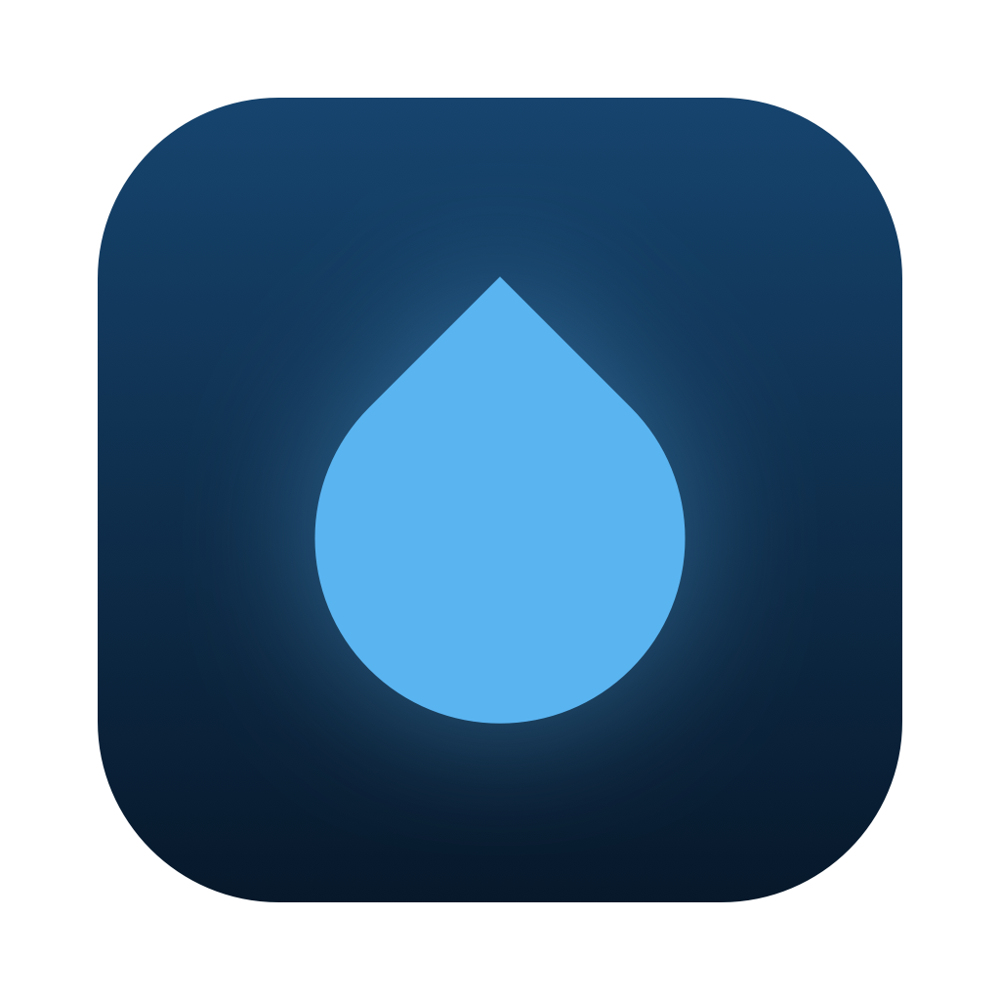
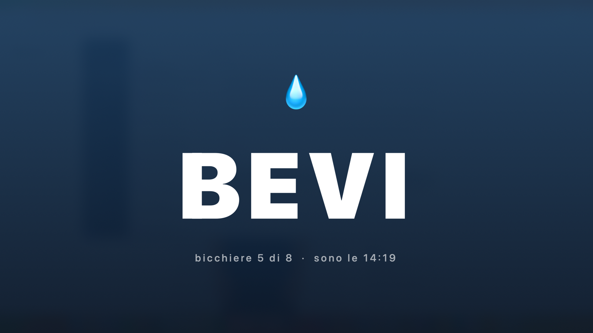
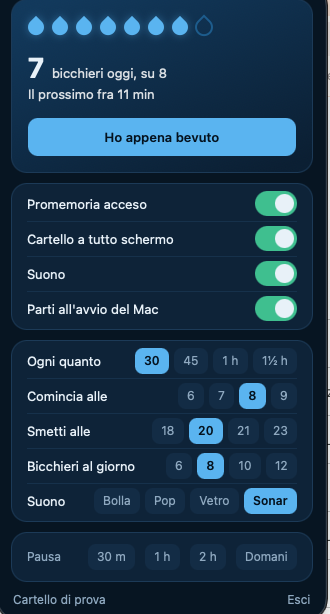

<div align="center">



# Bevi

**Una goccia nella barra del Mac che ti ricorda di bere, e tace quando non deve disturbare.**




</div>

Niente finestre, niente icona nel Dock, niente account, nessuna rete. Un clic sulla goccia
e c'è tutto: i bicchieri di oggi, «ho appena bevuto», il passo, la fascia oraria, la pausa.

Quando è il momento, un cartello blu attraversa tutti i monitor per due secondi e sparisce
da solo. Non ruba il fuoco alla tastiera: se stai scrivendo, le lettere continuano ad
arrivare nell'app che sta sotto.

---

## Installazione

Serve solo Xcode Command Line Tools (`xcode-select --install`), niente altro.

```bash
git clone https://github.com/<utente>/bevi.git
cd bevi
./installa.sh
```

L'app finisce in `~/Applications/Bevi.app` e si accende subito. Per farla partire da sola
quando accendi il Mac: clic sulla goccia → **«Parti all'avvio del Mac»**.

Per disinstallarla: togli la spunta all'avvio automatico, esci dall'app e butta
`~/Applications/Bevi.app`. I dati stanno in una cartella sola (sotto), cancellabile a mano.

---

## Quando tace

È la parte che conta davvero: un cartello a tutto schermo che compare **mentre condividi
lo schermo in una riunione** è il difetto peggiore che un programma così possa avere.

Bevi sta zitta se:

| Situazione | Come se ne accorge |
|---|---|
| **Sei in videochiamata** | la webcam è accesa, oppure un microfono è occupato **senza pause per 14 secondi** |
| **Stai dettando** | il microfono si libera per un istante → era dettatura, non una call |
| **Non sei davanti al Mac** | tastiera e mouse fermi da più di 10 minuti |
| **Lo schermo è bloccato** | sessione bloccata |
| **Hai un Focus acceso** | «Non disturbare» o qualunque altro Focus |
| **Fuori dalla tua fascia oraria** | o durante una pausa che hai chiesto tu |

⭐ E in nessuno di questi casi **l'avviso si brucia**: l'orologio non riparte, il promemoria
resta in canna e esce appena il momento è buono. Se torni al Mac dopo un'ora di riunione,
lo trovi lì ad aspettarti — non ne hai persi tre.

> **Perché il microfono e non la lista delle app.** Rincorrere Meet, Zoom, Teams, Slack,
> FaceTime una per una è una lista che non finisce mai e invecchia da sola. Si chiede invece
> al Mac se lo stream d'ingresso di un microfono è aperto: in una chiamata resta aperto
> anche in muto, e a riposo nessuno lo tiene acceso a vuoto. Copre anche le app che non
> conosciamo.

---

## Il pannello



Un clic sulla goccia e scende il pannello. Non è un menu di sistema: è disegnato, con la
stessa identità del cartello a tutto schermo.

- le **gocce** della giornata, che si riempiono, col numero grande e quanto manca al prossimo
- **Ho appena bevuto**, che segna un bicchiere e fa ripartire l'orologio
- gli **interruttori**: promemoria acceso, cartello a tutto schermo, suono, avvio automatico
- le **regolazioni**: ogni quanto (30/45/60/90 min), da che ora a che ora, bicchieri al giorno
- il **suono**: quattro suoni brevi già presenti su ogni Mac, e si sentono quando li scegli
  (Bolla = `Bottle`, Pop = `Pop`, Vetro = `Glass`, Sonar = `Submarine`)
- la **pausa**: 30 minuti, 1 ora, 2 ore, fino a domani
- in fondo: un **cartello di prova**, che non conta nessun bicchiere, e **Esci**

Tre regole tengono insieme il disegno: l'azzurro è solo azione e selezione, mai decorazione;
i controlli parlano una lingua sola (pillole ovunque); il movimento dura 180 ms e serve a
dire che qualcosa è cambiato, non a fare scena.

> **Perché l'interruttore è disegnato a mano invece di usare quello di macOS.** Quello di
> sistema prende il **colore accento** scelto nelle impostazioni del Mac: su una macchina con
> l'accento arancione o rosso, quattro interruttori accesi litigano con tutto il resto. La
> forma resta identica a quella di sistema, cambia solo il colore.

<br clear="right">

---

## Dove tiene i dati

In `~/Library/Application Support/Bevi/`, due file di testo:

- **`config`** — le preferenze, in formato `chiave=valore`. Volutamente banale: lo si legge
  e lo si scrive anche da uno script di shell (`. config`), o a mano con un editor.
- **`stato`** — quando è uscito l'ultimo promemoria, che giorno è, quanti bicchieri.

Puoi spostare la cartella impostando la variabile d'ambiente `BEVI_HOME`.

Nessuna rete, nessuna telemetria, nessun account: i dati non escono mai dal tuo Mac.

---

## Com'è fatta

Quattro file Swift, nessuna dipendenza esterna.

| File | Cosa fa |
|---|---|
| `Sorgenti/main.swift` | l'icona nella barra, il menu, il controllo ogni 30 secondi |
| `Sorgenti/Impostazioni.swift` | leggere e scrivere `config` e `stato` |
| `Sorgenti/Presenza.swift` | webcam, microfono, inattività, schermo bloccato, Focus |
| `Sorgenti/Cartello.swift` | il cartello a tutto schermo |

I controlli girano **in ordine di costo**: quasi tutti i risvegli si fermano alla prima
domanda, che costa quanto leggere un file di novanta byte. Quelli cari — il Focus e la
chiamata in corso — si pagano una volta all'ora scarsa, quando tutto il resto ha già detto sì.

Il controllo della chiamata può dormire fino a 14 secondi, quindi gira **su una coda di
sfondo**: l'interfaccia non si pianta mai.

Per ricompilare senza installare: `./costruisci.sh` → `build/Bevi.app`.

**Collaudo automatico.** Un pannello che si disegna ma non comanda niente è il difetto che
uno scatto non fa vedere, quindi l'app sa premersi i controlli da sola:

```bash
BEVI_HOME=/tmp/prova-bevi ./build/Bevi.app/Contents/MacOS/Bevi --collaudo
```

Preme le pillole, gli interruttori e il bottone lungo la stessa strada del mouse, poi
controlla che il file di configurazione sia davvero cambiato. Esce 0 se è tutto a posto.
`--anteprima` apre il pannello da solo, comodo per guardarlo.

---

## Quanto consuma

Misurato su un Mac Apple Silicon, app in servizio con il pannello chiuso.

| | |
|---|---|
| **Memoria** | 16 MB di impronta reale, quella che mostra Monitoraggio Attività |
| **CPU** | 0,049% di un core: **43 secondi di calcolo in 24 ore** accese |
| **Risvegli inutili** | 2 ogni 30 secondi |
| **Impatto energetico** | 0.0 |

Non è un caso, è il progetto: il controllo ogni 30 secondi si ferma quasi sempre alla prima
domanda, che è leggere un file di novanta byte. Le domande care (il Focus, la chiamata in
corso) si pagano una volta all'ora scarsa, e solo dopo che tutto il resto ha detto sì.

## In English

**Bevi** is a macOS menu bar app that reminds you to drink water, and knows when to keep
quiet. It stays silent while you are on a video call (it watches whether the webcam is on
or a microphone has been busy without interruption for 14 seconds, which tells a meeting
apart from dictation), while a Focus is on, when the screen is locked, and when you have
been away from the keyboard for ten minutes. In none of those cases is the reminder burned:
the clock does not restart, so it is still waiting for you when you come back.

Four Swift files, no dependencies, no network, no account. Build and install with
`./installa.sh`. Settings live in two plain text files under
`~/Library/Application Support/Bevi/`. The interface is in Italian.

## Licenza

MIT — vedi [LICENSE](LICENSE).
